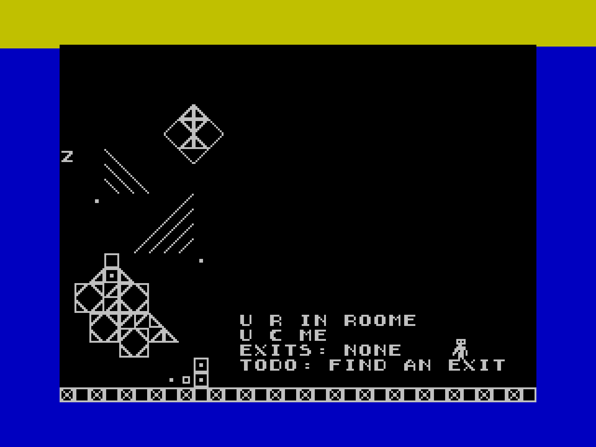
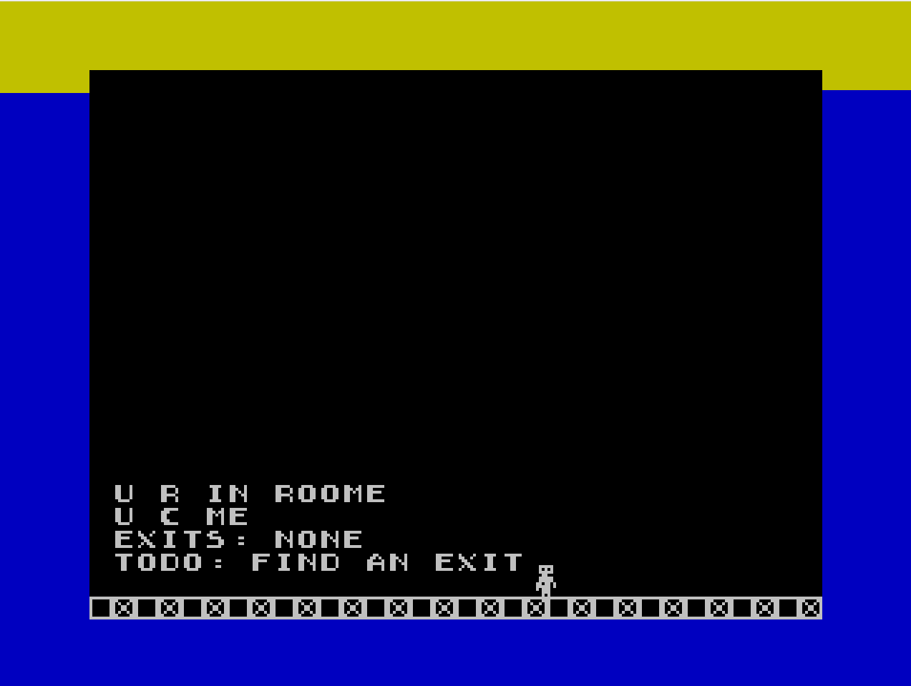

# spectrum 48k

## intention

* learn cpu z80 by writing assembler for spectrum 48k
* render tile map
* sprites with collision detection
* read keyboard
* miniature game
  * keys: `a`,`d`: left, right; `g`: jump

## tools

* `fuse 1.6.0`: spectrum 48 emulator
* `pasmo 0.5.5`: assembler
* `tiled 1.11.2`: tile map editor
* `gimp 3.0.6`: image manipulator
* `python 3.13.11`: automation

## notes

* releases are considered finished
* tagged versions have been played to completion
* latest commit is under development

## screenshots

