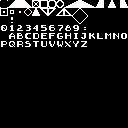
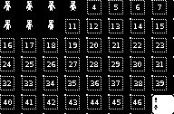

# resources used for generated source

## custom charset used in application

* edit the 2 color (foreground / background) `custom-charset.png` or use `gimp`
  to edit `custom-charset.xcf` and export

## sprites

## tile map

* use `tiled` to edit project `world.tiled-project`

## howto

* run `update.sh` to refresh generated source in `../src/`

## miscellaneous

### standard c64 charset

### source generators

* `gen-charset.py`
* `gen-render-to-screen.py`
* `gen-sprites-state-update.py`
* `gen-tile-map.py`
* `gen-sprites-data.py`
